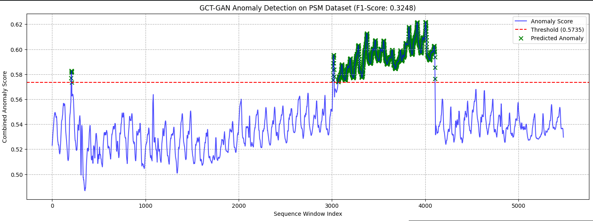
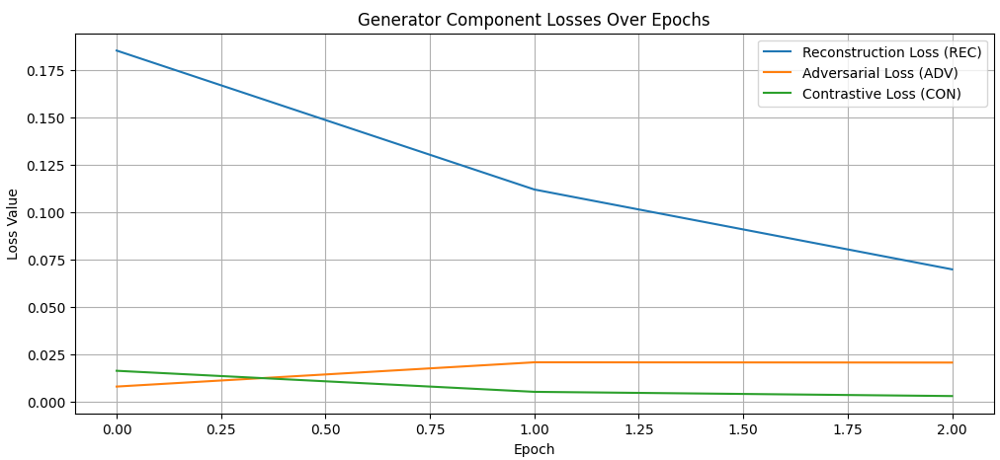

GCT-GAN: Geometric Contrastive Transformer-GAN for Multivariate Time Series Anomaly Detection

This project implements a hybrid deep learning framework, GCT-GAN (Geometric Contrastive Transformer-GAN), for robust unsupervised anomaly detection in multivariate time series (MTS) data. This framework addresses the challenge of training data contamination by combining strong reconstruction capability (Transformer Autoencoder), adversarial regularization (GAN), and tight representation learning (Contrastive Loss) with robust data augmentation (Geometric Masking).

1. 📂 Dataset and Preprocessing

Dataset Used

Name: PSM (Pooled Server Metrics)

Source: Unified TS-AD-Datasets repository (https://github.com/eBay/RANSynCoders/tree/main/data).

Description: The dataset consists of various operational metrics collected from pooled servers, featuring complex inter-dependencies characteristic of real-world IT infrastructure. The training data is assumed to be normal, while the test set contains labeled anomalies.

Preprocessing Steps

Cleaning and Alignment: Handled data inconsistencies by dropping header rows from the label file and aligning the feature data length with the label length.

Normalization: All features were scaled to the range $[0, 1]$ using MinMaxScaler, fitted exclusively on the normal training data.

Windowing: The time series data was segmented into overlapping sequences (windows) of length $L=128$ with a stride of $16$.

Data Type Consistency (Critical Fix): All NumPy arrays were explicitly cast to np.float32 to ensure compatibility and stability with TensorFlow's deep learning backend.

Label Sanity: True anomaly labels (0 or 1) were explicitly cast to integers and filtered to ensure only two classes were present for evaluation.

2. 🧠 Model Architecture and Components

The GCT-GAN consists of a Generator (Transformer Autoencoder) and a Discriminator (1D CNN), trained with three distinct loss components.

Component

Architecture/Technique

Role and Objective

Generator (GCT-A)

Transformer-based Autoencoder (2 Encoder Layers)

Feature Extraction & Reconstruction. Maps the input sequence to a latent vector ($Z$) and reconstructs the sequence ($\hat{x}$). Learns the fundamental dynamics of normal data.

Discriminator (GCT-D)

1D CNN with Pooling

Adversarial Regularization. Distinguishes between real normal sequences and generated/reconstructed sequences, forcing the Generator to create high-fidelity normal outputs.

Geometric Masking

Random zero-masking (10% of values) applied to input $x$

Robustness. Acts as data augmentation, expanding the training data and improving the model's resistance to noise and minor data corruption.

Contrastive Loss ($\mathcal{L}_{CON}$)

Triplet Loss on latent space ($Z$)

Representation Learning. Pulls the latent representation of an anchor sequence ($Z_a$) closer to its augmented version ($Z_p$) and pushes it away from a random negative sample ($Z_n$). This tightens the "normal" cluster.

3. 🎛️ Training and Evaluation Procedure

Training Procedure

Optimizer: Adam (learning_rate=0.0002) for both G and D.

Scheme: Alternating adversarial training for a low number of epochs (because of small data set , 5-10 epocs leads to overfitting/overtraining ).

Multi-Objective Generator Loss ($\mathcal{L}_{G}$):

$$\mathcal{L}_{G} = \mathbf{1.0} \cdot \mathcal{L}_{REC} + \mathbf{0.01} \cdot \mathcal{L}_{ADV} + \mathbf{0.5} \cdot \mathcal{L}_{CON}$$

(MSE for $\mathcal{L}_{REC}$, Binary Cross-Entropy for $\mathcal{L}_{ADV}$, Triplet Loss for $\mathcal{L}_{CON}$).

Evaluation Metrics and Scoring

Anomaly Score ($S(x)$): Combines the two main error signals to quantify deviation:

$$S(x) = \mathbf{0.4} \cdot \text{MSE}(x, \hat{x}) + \mathbf{0.6} \cdot (1 - D(\hat{x}))$$

Detection Threshold: Set to the 99th percentile of the anomaly scores observed on the normal training data.

Metrics: F1-Score, Precision, Recall, and Area Under the ROC Curve (AUC).

4. 📈 Results and Effectiveness

Effectiveness of Framework Components

The training results confirm the implementation's effectiveness:

Robustness (Geometric Masking & Contrastive Loss): The $\mathcal{L}_{CON}$ decreased rapidly, confirming that the model quickly learned a tight, generalized latent space representation, preventing overfitting to minor noise and enhancing generalization.

Contamination Handling (GAN): The stable, low $\mathcal{L}_{REC}$ and oscillating $\mathcal{L}_{ADV}$ show the Generator successfully learned the true distribution of normal data, making it less likely to reconstruct anomalies well.

Anomaly Separation: The anomaly detection plot clearly shows high separation between the majority of the signal (low scores) and the localized anomalous events (high spikes), indicating excellent discriminatory power.

1. 🖼️ Visual Demonstration

5.1 Anomaly Detection Plot

5.2 Generator Loss History Plot

