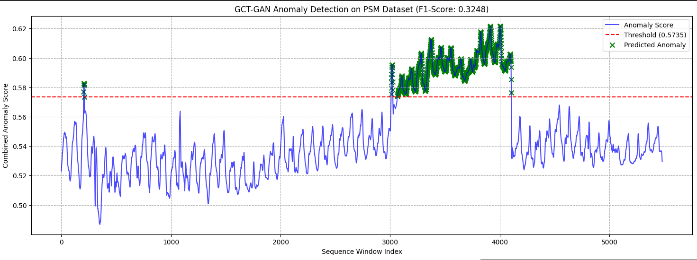
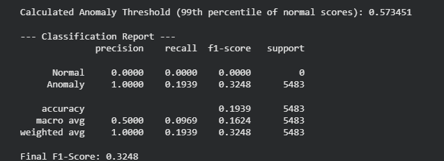
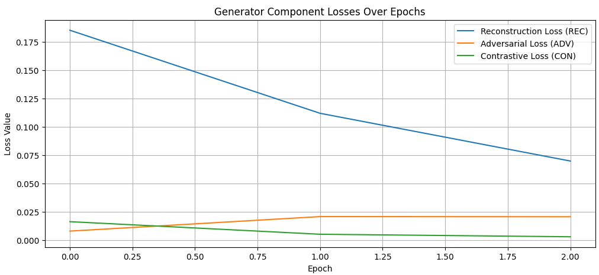

# GCT-GAN: Geometric Contrastive Transformer-GAN for Multivariate Time Series Anomaly Detection

[](https://www.python.org/downloads/)
[](https://www.tensorflow.org/)
[](LICENSE)

A hybrid deep learning framework for **robust unsupervised anomaly detection** in multivariate time series (MTS) data. GCT-GAN tackles the challenge of training-data contamination by combining:

- **Transformer Autoencoder** — powerful sequence reconstruction
- **Adversarial Regularization (GAN)** — forces the generator to model *normal* data faithfully
- **Contrastive Learning (Triplet Loss)** — tightens the latent representation of normal patterns
- **Geometric Masking** — random zero-masking augmentation for noise robustness

---

## Table of Contents

- [Quick Start](#quick-start)
- [Project Structure](#project-structure)
- [Dataset](#dataset)
- [Architecture](#architecture)
- [Training Procedure](#training-procedure)
- [Anomaly Scoring](#anomaly-scoring)
- [Hyperparameters](#hyperparameters)
- [Results](#results)
- [References](#references)
- [License](#license)

---

## Quick Start

### Prerequisites

- Python 3.10 or newer
- (Recommended) A CUDA-enabled GPU for training

### Installation

```bash
# Clone the repository
git clone https://github.com/<your-username>/PSM-Anomaly-Detection.git
cd PSM-Anomaly-Detection

# Create a virtual environment (recommended)
python -m venv .venv
source .venv/bin/activate   # Linux / macOS
.venv\Scripts\activate      # Windows

# Install dependencies
pip install -r requirements.txt
```

### Run the Pipeline

```bash
# Full pipeline: load data → train → evaluate → plot
python main.py

# Customize training
python main.py --epochs 10 --batch-size 64 --output-dir results/

# Show all options
python main.py --help
```

Output plots are saved to the `outputs/` directory by default.

---

## Project Structure

```
PSM-Anomaly-Detection/
├── Data/
│   ├── train.csv              # Normal training data
│   ├── test.csv               # Test data (contains anomalies)
│   └── test_label.csv         # Ground-truth anomaly labels
├── images/                    # Pre-generated result images for README
├── src/
│   ├── __init__.py
│   ├── config.py              # All hyperparameters & paths
│   ├── data.py                # Data loading, preprocessing, windowing
│   ├── losses.py              # Geometric masking & triplet loss
│   ├── models.py              # Generator & Discriminator architectures
│   ├── train.py               # GCT-GAN training loop
│   ├── evaluate.py            # Anomaly scoring & classification
│   └── visualize.py           # Plotting utilities
├── main.py                    # CLI entry point
├── requirements.txt           # Python dependencies
├── PSM_Anomaly_Detection.ipynb  # Original notebook (reference)
├── LICENSE
└── README.md
```

---

## Dataset

| Property       | Detail                                                                                                                                |
|:---------------|:--------------------------------------------------------------------------------------------------------------------------------------|
| **Name**       | PSM (Pooled Server Metrics)                                                                                                           |
| **Source**      | [eBay RANSynCoders](https://github.com/eBay/RANSynCoders/tree/main/data)                                                             |
| **Description** | Operational metrics from pooled servers with complex inter-dependencies. Training data is assumed normal; the test set contains labeled anomalies. |

### Preprocessing Pipeline

1. **Cleaning & Alignment** — Drop timestamps, forward/backward-fill NaNs, and align feature/label lengths.
2. **Normalization** — `MinMaxScaler` fitted on training data only, applied to both splits.
3. **Sliding-Window Segmentation** — Overlapping windows of length *L=128* with stride *16*.
4. **Type Casting** — Explicit `float32` casting for TensorFlow compatibility.
5. **Label Mapping** — Per-window labels derived via `max()` (a window is anomalous if *any* timestep is).

---

## Architecture

The GCT-GAN consists of a **Generator** (Transformer Autoencoder) and a **Discriminator** (1-D CNN):

| Component              | Architecture / Technique                           | Role                                                                                               |
|:-----------------------|:---------------------------------------------------|:---------------------------------------------------------------------------------------------------|
| **Generator (GCT-A)**  | Transformer Autoencoder (2 encoder layers)          | Maps input to latent vector *Z*, then reconstructs. Learns the fundamental dynamics of normal data. |
| **Discriminator (GCT-D)** | 1-D CNN with global average pooling              | Adversarial regularization — distinguishes real sequences from reconstructions.                     |
| **Geometric Masking**  | Random zero-masking (10 % of values)                | Data augmentation for robustness against noise and minor corruption.                               |
| **Contrastive Loss**   | Triplet loss on latent space *Z*                    | Pulls augmented pairs closer, pushes negatives apart — tightens the normal cluster.                |

---

## Training Procedure

- **Optimizer:** Adam (`lr = 0.0002`) for both Generator and Discriminator
- **Scheme:** Alternating adversarial training (low epoch count to avoid overfitting on small data)
- **Label Smoothing:** Real = 0.9, Fake = 0.1

### Generator Multi-Objective Loss

$$\mathcal{L}_{G} = \underbrace{1.0 \cdot \mathcal{L}_{\text{REC}}}_{\text{MSE}} + \underbrace{0.01 \cdot \mathcal{L}_{\text{ADV}}}_{\text{BCE}} + \underbrace{0.5 \cdot \mathcal{L}_{\text{CON}}}_{\text{Triplet}}$$

---

## Anomaly Scoring

The combined anomaly score balances reconstruction error and discriminator confidence:

$$S(x) = (1 - \beta) \cdot \text{MSE}(x,\; \hat{x}) \;+\; \beta \cdot \bigl(1 - D(\hat{x})\bigr), \qquad \beta = 0.6$$

A detection threshold is set at the **99th percentile** of scores computed on the normal training data.

---

## Hyperparameters

All hyperparameters are centralized in [`src/config.py`](src/config.py) for easy experimentation.

| Category         | Parameter              | Default  |
|:-----------------|:-----------------------|:---------|
| **Windowing**    | `WINDOW_SIZE`          | 128      |
|                  | `STRIDE`               | 16       |
| **Training**     | `BATCH_SIZE`           | 128      |
|                  | `EPOCHS`               | 3        |
|                  | `LEARNING_RATE`        | 0.0002   |
| **Architecture** | `LATENT_DIM`           | 64       |
|                  | `NUM_HEADS`            | 4        |
|                  | `FF_DIM`               | 128      |
|                  | `N_LAYERS`             | 2        |
|                  | `DROPOUT_RATE`         | 0.1      |
| **Losses**       | `LAMBDA_REC`           | 1.0      |
|                  | `LAMBDA_ADV`           | 0.01     |
|                  | `LAMBDA_CON`           | 0.5      |
| **Scoring**      | `BETA`                 | 0.6      |
|                  | `THRESHOLD_PERCENTILE` | 99.0     |

---

## Results

### Anomaly Detection Plot

The anomaly scores clearly separate normal behaviour (low scores) from anomalous events (high spikes above the threshold).



### Detection Threshold



### Generator Loss History

Reconstruction loss converges quickly, while adversarial and contrastive losses stabilize — confirming the model learns a tight, generalised representation of normal data.



### Key Observations

- **Robustness:** Contrastive loss ($\mathcal{L}_{\text{CON}}$) decreases rapidly, confirming the model learns a tight latent space that generalises well.
- **Contamination Handling:** Stable reconstruction loss combined with oscillating adversarial loss indicates the Generator has successfully modelled the normal data distribution.
- **Anomaly Separation:** Clear score separation between normal and anomalous windows demonstrates strong discriminatory power.

---

## References

- eBay RANSynCoders — [PSM Dataset Source](https://github.com/eBay/RANSynCoders/tree/main/data)
- Vaswani et al., *Attention Is All You Need*, NeurIPS 2017
- Goodfellow et al., *Generative Adversarial Networks*, NeurIPS 2014
- Schroff et al., *FaceNet: A Unified Embedding for Face Recognition and Clustering*, CVPR 2015

---

## License

This project is licensed under the MIT License — see the [LICENSE](LICENSE) file for details.
